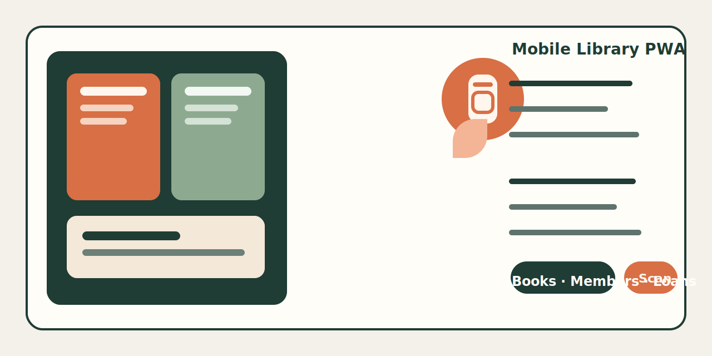

# Library System



Mobile-first library management MVP for small libraries, classrooms, schools, and nonprofit reading rooms.

This project is built around a simple real-world workflow:
- use a phone as the barcode scanner
- create books and members on site
- check books in and out quickly
- keep cover photos and member photos
- run on a local PC with internal HTTPS for iPhone camera access

## Highlights

- Mobile PWA for day-to-day library operations
- Book create, list, edit
- Member create, list, edit
- Checkout and return API flow
- Barcode scanning with phone camera
- ISBN metadata lookup with manual fallback
- Duplicate checks for ISBN and accession code
- Local image upload for book covers and member photos
- PostgreSQL backend with Express + TypeScript
- Internal HTTPS via Caddy for iPhone compatibility

## Current Scope

### Mobile PWA
- `/mobile`
- `/mobile/books`
- `/mobile/books/new`
- `/mobile/books/:id/edit`
- `/mobile/members`
- `/mobile/members/new`
- `/mobile/members/:id/edit`
- `/mobile/loan`
- `/mobile/return`

### Core API
- `GET /api/books`
- `GET /api/books/check`
- `GET /api/books/lookup/isbn/:isbn`
- `POST /api/books`
- `PATCH /api/books/:id`
- `GET /api/members`
- `POST /api/members`
- `PATCH /api/members/:id`
- `GET /api/loans`
- `POST /api/loans/checkout`
- `POST /api/loans/return`
- `POST /api/uploads/book-cover`
- `POST /api/uploads/member-photo`

## Tech Stack

- Frontend: Next.js
- Backend: Express + TypeScript
- Database: PostgreSQL
- Reverse proxy: Caddy
- Mobile scanning: browser camera + barcode scanner component

## Project Structure

```text
library-system/
  backend/        Express + TypeScript API
  database/       PostgreSQL schema and seed data
  docs/           notes, assets, and devlog
  frontend/       Next.js mobile PWA
  infra/caddy/    local HTTPS reverse proxy
```

## Local URLs

- Frontend: `http://localhost:3000`
- Backend API: `http://localhost:4000`
- Internal HTTPS entry: `https://192.168.0.112`
- Mobile flow: `https://192.168.0.112/mobile`

## Quick Start

### 1. Database

```bash
psql -U postgres -d library_system -f database/schema.sql
psql -U postgres -d library_system -f database/dev-seed.sql
```

### 2. Backend

```bash
cd backend
npm install
npm run dev
```

### 3. Frontend

```bash
cd frontend
npm install
npm run dev
```

## Notes

- If ISBN metadata lookup cannot find a result, the create-book page still supports manual entry.
- iPhone camera scanning requires HTTPS.
- Local `.env`, uploaded files, certificates, and build artifacts are intentionally ignored in git.
- This repo is currently optimized for internal deployment and MVP iteration speed.

## Next Experiments

- inventory workflow
- list search and filters
- stronger duplicate prevention rules
- improved Chinese ISBN metadata coverage
- overdue reminders and circulation reporting

## Docs

- [DEVLOG](docs/DEVLOG.md)
- [Database Notes](database/README.md)
